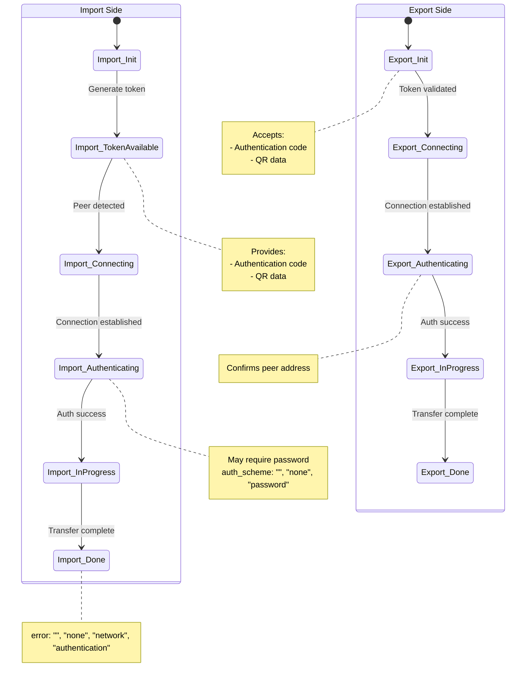
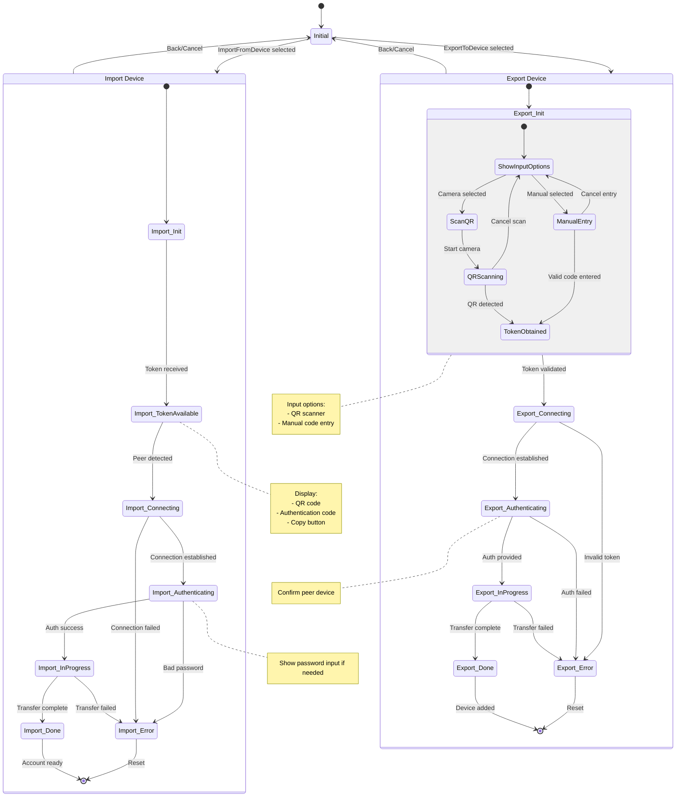
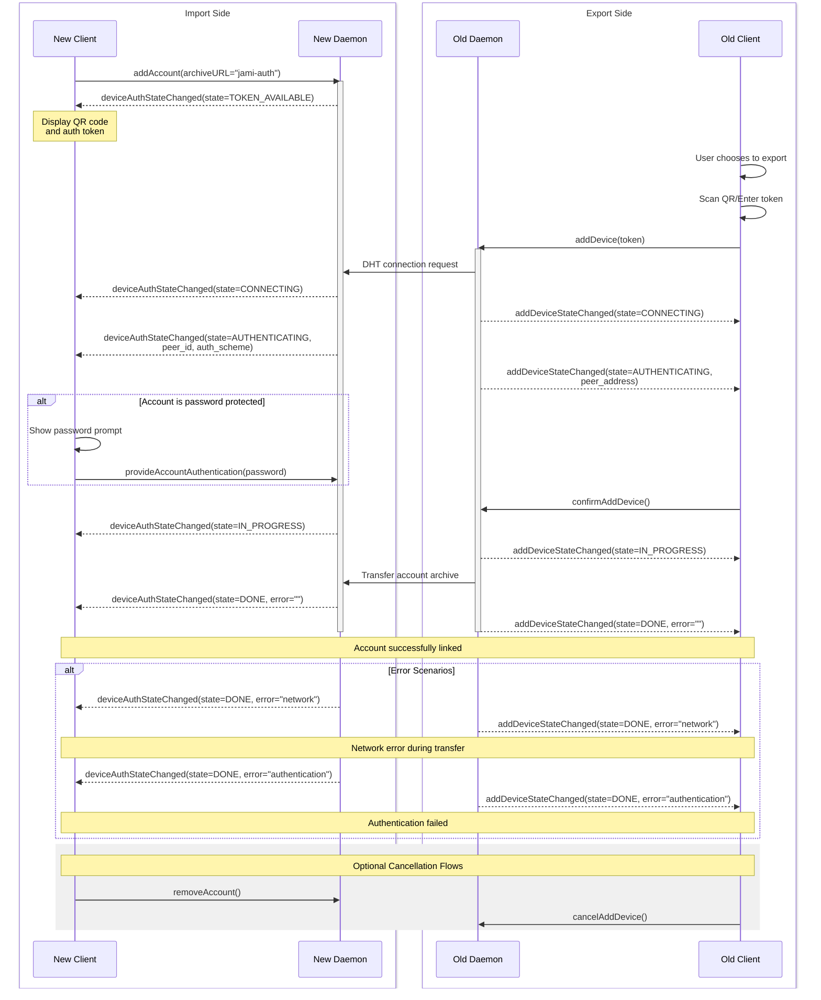

# **Add device feature**

This document describes the architecture of the feature allowing users to link their account to a new device, referred to as the `Add a New Device` process.

## **Terminology**

To understand this document, here are some key terms:

- **`import side`**: The device importing the account.
- **`export side`**: The device exporting its account.
- **`token`**: A URI that identifies a device on the Distributed Hash Table (DHT).

---

## **State Machine**

The `daemon` manages this functionality using a state machine.

The state evolution is communicated to clients, enabling the appropriate interface display.

Currently, the state machine is symmetrical for both `import side` and `export side`, though certain states are inaccessible depending on the side.

### **State Overview**

| **Number** | **Name**        | **Usage (Side)** | **Description**                                              |
| ---------- | --------------- | ---------------- | ------------------------------------------------------------ |
| 0          | Init            | None             | Initial state.                                               |
| 1          | Token available | Import only      | The `token` is available. This is the URI identifying the new device on the DHT, displayed as text or a QR code. |
| 2          | Connecting      | Export/Import    | A peer-to-peer connection is being established.              |
| 3          | Authenticating  | Export/Import    | The identity of the account and device address are being confirmed. |
| 4          | In progress     | Export/Import    | The account archive is being transferred.                    |
| 5          | Done            | Export/Import    | Final state. Represents success or failure.                  |

---

### **Details**

The state machine can include supplementary information for display purposes, passed as a `map<String, String>` called `details`.

#### **Details for `import side`**

| **Number** | **Name**        | **Details**                                                  |
| ---------- | --------------- | ------------------------------------------------------------ |
| 0          | Init            | Not applicable.                                              |
| 1          | Token available | `token`: A 59-character URI with the prefix `jami-auth://`.  |
| 2          | Connecting      | No details.                                                  |
| 3          | Authenticating  | `peer_id`: Jami ID of the imported account. `auth_scheme`: `{"", "none", "password"}` (empty if unprotected). `auth_error`: `{"bad_password"}`. |
| 4          | In progress     | No details.                                                  |
| 5          | Done            | `error`: `{"", "none", "network", "authentication"}` (empty if no error). |

#### **Details for `export side`**

| **Number** | **Name**        | **Details**                                                  |
| ---------- | --------------- | ------------------------------------------------------------ |
| 0          | Init            | Not applicable.                                              |
| 1          | Token available | Not applicable.                                              |
| 2          | Connecting      | No details.                                                  |
| 3          | Authenticating  | `peer_address`: IP address of the exporting device.          |
| 4          | In progress     | No details.                                                  |
| 5          | Done            | `error`: `{"", "none", "network", "authentication"}` (empty if no error). |

---

## **API Between Daemon and Client**

### **API for `import side`**

| **Signal Name**                | **Direction** | **Purpose**                                                  |
| ------------------------------ | ------------- | ------------------------------------------------------------ |
| `addAccount`                   | Outbound      | Announces the intent to import an account. Must include the key `Account.archiveURL="jami-auth"`. |
| `provideAccountAuthentication` | Outbound      | Provides a password if needed and confirms the identity of the imported account. |
| `removeAccount`                | Outbound      | Cancels the operation.                                       |
| `deviceAuthStateChanged`       | Inbound       | Indicates the new state and provides details.                |

---

### **API for `export side`**

| **Signal Name**         | **Direction** | **Purpose**                                   |
| ----------------------- | ------------- | --------------------------------------------- |
| `addDevice`             | Outbound      | Announces the intent to export an account.    |
| `confirmAddDevice`      | Outbound      | Confirms the address of the exporting device. |
| `cancelAddDevice`       | Outbound      | Cancels the operation.                        |
| `addDeviceStateChanged` | Inbound       | Indicates the new state and provides details. |

# Daemon state machine

# Client state machine

# Full sequence diagram
